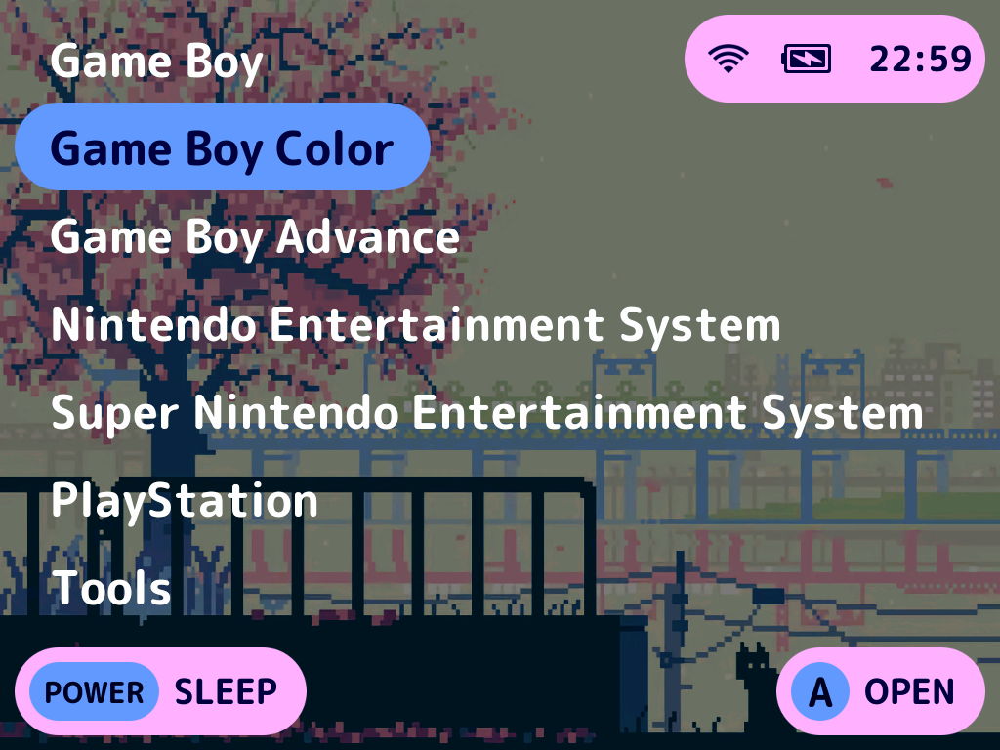

<div align="center">


<h3 style="font-size: 25px;">
    A download client for your TrimUI Brick running NextUI.
</h3>

<h4 style="font-size: 18px;">
Supports RomM, SMB, Megathread, Apache / nginx autoindex & HTML tables.

**Now with Thumbnail Support! _(Powered by the Libretro Thumbnail Project)_**
</h4>


</div>

---

<div align="center">
    
</div>

---

## How do I setup Mortar?

1. Own a TrimUI Brick and have a SD Card with NextUI configured.
2. Connect your Brick to a Wi-Fi network.
3. Download the latest Mortar release from this repo.
4. Unzip the release download.
5. Edit one of the templates in the `config_examples` directory. Once done save it as `config.yml` inside the
   `Mortar.pak` directory.
6. With your Brick powered off, eject the SD Card and connect it to your computer.
7. Copy the entire Mortar.pak file to `SD_ROOT/Tools/tg5040`.
8. Reinsert your SD Card into your Brick.
9. Launch `Mortar` from the `Tools` menu and enjoy!

## Configuration Reference

```yaml
hosts:
  - display_name: "Display Name"
    host_type: ROMM # Valid Choices: ROMM | MEGATHREAD | SMB | APACHE | NGINX | CUSTOM
    root_uri: "https://domain.tld" # This can be the start of a URL with protocol (e.g. https://), a host name or an IP Address

    port: 445 # Needed by SMB, optional otherwise unless using non-standard ports

    username: "GUEST" # Used by RomM and SMB
    password: "hunter2" # Used by RomM and SMB

    share_name: "guest" # Used by SMB

    extension_filters: # Used by SMB to hide files with given extensions
      - ".DS_Store"

    sections: # One or more mappings of host directory to the local filesystem
      - section_name: "Game Boy" # Name it whatever you want
        system_tag: "GB" # Must match the tag in the `SDCARD_ROOT/Roms` directories
        local_directory: "/mnt/SDCARD/Roms/Game Boy (GB)/" # Explicitly set the path. This will be overwritten if `system_tag` is set
        host_subdirectory: "/files/No-Intro/Nintendo%20-%20Game%20Boy/" # The subdirectory on the host, not used by RomM
        romm_platform_id: "1" # Used by RomM in place of `host_subdirectory`

        # Define more sections if desired

    filters: # Filter out files that do not contain the filter string
      - "USA"
      - "En,"

    table_columns: # Used by CUSTOM hosts. Match each value with the exact text used in the HTML Table
      filename_header: "File Name"
      file_size_header: "File Size"
      date_header: "Date"

    source_replacements: # Used by CUSTOM hosts. If the table contains extra junk (e.g. sort arrows, brackets, etc.) specify them here. They will be removed before parsing the table
      "[[": "[["
      "]]": "]]"

  # Define more hosts if desired

show_item_count: false # Shows file count before displaying list
download_art: true # If true, Mortar will attempt to find box art. If found it will display it and let you indicate if you want it
log_level: "ERROR" # Optional, defaults to error. Handy when shit breaks
```

Sample configuration files by host can be [found here](/resources/config_examples).

***

## Gotchas

While testing, I came across some gotchas. Here is what I caught.

- Filtering Language Tags
    - When using the filter feature on language tags `e.g. Filename (USA) (En, Fr, Jp).zip`, use the trailing comma or
      parenthesis so that my naive filtering implementation (*`<cough>`* string compares *`</cough>`*) doesn't just
      filter the filename.

- Apache Hosts
    - Apache host running mod_autoindex by default truncate their table file names.
    - To fix this, use the following `.htaccess` file in the parent directory of the files being served.

```
Options +Indexes
<IfModule mod_autoindex.c>
  IndexOptions NameWidth=*
</ifModule>
```

- nginx Hosts
    - nginx also truncates their filenames
    - To fix this, add these to your nginx config for the appropriate location

```
location / {
    root   /usr/share/html;
    index  index.html index.htm;
    
    autoindex on;
    autoindex_exact_size off;
    autoindex_format json;
    autoindex_localtime on;
}
```

## 🌸 Flower Giving Time! 🌸

Just want to give a huge shoutout
to [@ro8inmorgan](https://github.com/ro8inmorgan), [@frysee](https://github.com/frysee) and the rest of the NextUI
contributors for making the TrimUI
Brick an amazing experience. Also huge props to the work [@shauninman](https://github.com/shauninman) put into MinUI of
which NextUI is based.

I want to also shoutout [@josegonzalez](https://github.com/josegonzalez) for their
awesome [minui-list](https://github.com/josegonzalez/minui-list), [miniui-presenter](https://github.com/josegonzalez/minui-presenter)
and [minui-keyboard](https://github.com/josegonzalez/minui-keyboard) projects.

Without these phenomenal pieces of software I likely would not have built Mortar.

✌️
